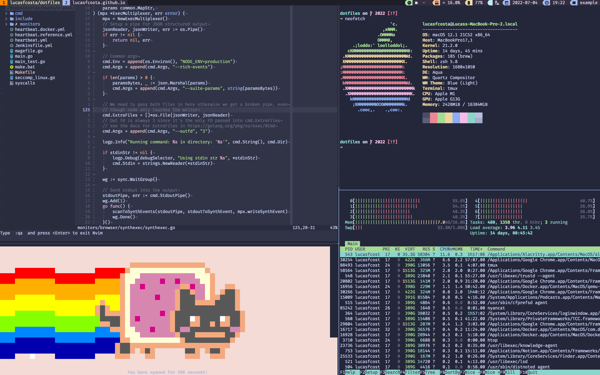

# dotfiles - [Lucas F. Costa](https://lucasfcosta.com)

The best dotfiles in the entire universe.




## Usage Guidelines

### Installing terminal programs

The terminal programs I use can be installed through [`brew`](https://brew.sh) by running `brew.sh`, just like this:

```console
$ . ./dotfiles/brew.sh
```

I also had to make a `misc-installs.sh` script to install other necessary pieces of software which I could not install using `brew`. This includes [the `zsh-spaceship` prompt](https://github.com/denysdovhan/spaceship-prompt).

:warning: **I recommend you to run this script before running any of the others as they might depend on programs previously installed.**


### Installing GUI applications

Most GUI applications I use — the ones that aren't bloatware — can also be installed through [`homebrew-cask`](https://github.com/Homebrew/homebrew-cask) by running `casks.sh`:

```console
$ . ./dotfiles/casks.sh
```


### MacOS Defaults

These are my favourite configurations for MacOS and I highly recommend you to at least take a look at this file and figure out what are yours.

Having all these set up in a single script is a huge life-quality improvement. Being able to setup simple things like showing file extensions, menu extras, dock settings, update checks and etc at the speed of a command has definitely changed my life for the better.

To run the script which sets those up just run `.macos`:

```console
$ ./dotfiles/.macos
```


### Dotfiles

Well, this repository could not be called `dotfiles` if it didn't actually have any dotfiles, right?

These contain configs for `nvim`, `zsh`, `tmux` and `git`.

To copy them to their correct places just run `install.sh`:

```console
$ . ./dotfiles/install.sh
```


## Things you will have to do manually

Unfortunately, life has not yet given me the opportunity to make everything in this repo automatic, so here's a few things you will have to do by yourself:


### Install tmux plugins

Once you have ran `install.sh` to copy dotfiles to their right places (including `.tmux.conf`), open `tmux` and press `prefix` (<kbd>ctrl</kbd> + <kbd>a</kbd>) + <kbd>I</kbd> (capital I, as in **I**nstall) to fetch the plugin.


### Set Iterm's color preset

Open Iterm configs by pressing <kbd>command</kbd> + <kbd>,</kbd>, go to `Profiles` and then `Colors`.

Choose the `Nord.itermcolors` color preset.


### Install powerline fonts and configure iTerm to use them

In order for [powerline](https://github.com/powerline/powerline) to work properly you will need to have [powerline/fonts](https://github.com/powerline/fonts) installed.

To install them you just need to clone the [powerline/fonts](https://github.com/powerline/fonts) repo and run the `install.sh` script present in their root folter.

Then, in order to configure Iterm to use one of these fonts, open Iterm's configs by pressing <kbd>command</kbd> + <kbd>,</kbd>, go to `Profiles` and then `Text` and click on `Change Font` to choose one of the fonts `for Powerline`.


## Related Content

* [How I'm still not using GUIs in 2019: A guide to the terminal](https://lucasfcosta.com/2019/02/10/terminal-guide-2019.html)
* [In Praise of Plain Text](https://lucasfcosta.com/2018/08/05/In-Praise-of-Plaintext.html)
* [Vim Tips (outdated)](https://lucasfcosta.com/2017/01/23/Quick-vIM-Tips-That-Will-Save-Your-Life.html)
* [My first blog post about vim (outdated)](https://lucasfcosta.com/2016/09/25/How-I-Learned-to-Stop-Worrying-and-Love-vIM.html)
