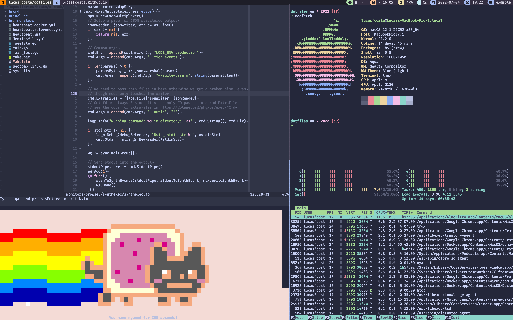

# dotfiles - [Lucas F. Costa](https://lucasfcosta.com)

The best dotfiles in the entire universe.



These dotfiles target macOS. On other platforms you'll need to adapt `programs.sh`.


## Quickstart

```console
$ git clone https://github.com/lucasfcosta/dotfiles && cd dotfiles
$ ./programs.sh   # installs Homebrew, terminal apps, fonts, Node, Claude Code
$ ./install.sh    # copies dotfiles into your home directory
$ ./.macos        # (optional) apply my macOS system defaults
```

Then restart your terminal.


## What's in here

### `programs.sh`

Installs everything I rely on via Homebrew: Alacritty, Neovim, tmux, ripgrep, nvm + Node, Fira Code Nerd Font, Docker, Chrome, and Claude Code (plus a few official Claude plugins).

It bootstraps Homebrew itself if you don't already have it.

### `install.sh`

`rsync`s the dotfiles in this repo into your home directory. Run it again any time you pull new changes.

### `.macos`

My preferred macOS system defaults (Finder, Dock, key repeat, etc.). Worth at least skimming before running.

### Configs

* **zsh** — `.zshrc` plus `.config/zsh/` (aliases, prompt, light/dark theme switcher in `hackermode.zsh`)
* **nvim** — `.config/nvim/`, fully Lua-based (`lazy.nvim` for plugins)
* **tmux** — `.config/tmux/tmux.conf` with light/dark theme files
* **alacritty** — `.config/alacritty/alacritty.toml` with light/dark color presets
* **git** — `.gitconfig`
* **claude code** — `.claude/` (settings, statusline, `CLAUDE.md`)


## Things you still have to do manually

### Install tmux plugins

After `install.sh` copies `.tmux.conf`, open tmux and press `prefix` (<kbd>ctrl</kbd> + <kbd>a</kbd>) + <kbd>I</kbd> to fetch plugins.

### Pick a Nerd Font in Alacritty

`programs.sh` installs Fira Code Nerd Font, but if you swap fonts, update `.config/alacritty/alacritty.toml` with the new family name.


## Related Content

* [How I'm still not using GUIs in 2019: A guide to the terminal](https://lucasfcosta.com/2019/02/10/terminal-guide-2019.html)
* [In Praise of Plain Text](https://lucasfcosta.com/2018/08/05/In-Praise-of-Plaintext.html)
* [Vim Tips (outdated)](https://lucasfcosta.com/2017/01/23/Quick-vIM-Tips-That-Will-Save-Your-Life.html)
* [My first blog post about vim (outdated)](https://lucasfcosta.com/2016/09/25/How-I-Learned-to-Stop-Worrying-and-Love-vIM.html)
