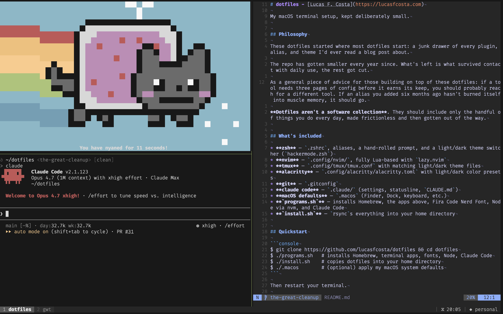

<p align="center">
  
</p>

# dotfiles - [Lucas F. Costa](https://lucasfcosta.com)

My macOS terminal setup, kept deliberately small.


## Philosophy

These dotfiles started where most dotfiles start: a junk drawer of every plugin, alias, and theme I'd ever read a blog post about.

The repo has gotten smaller every year since. What's left is what survived contact with daily use, the rest got cut.

As a general piece of advice for those building on top of these dotfiles: if a tool needs three pages of config before it earns its keep, you should probably reach for a different tool. If an alias you added six months ago hasn't burned itself into muscle memory, it should go.

**Dotfiles aren't a software collection**. They should include only the handful of things you do every day, made frictionless and then gotten out of the way.


## What's included

* **zsh** — `.zshrc`, aliases, a hand-rolled prompt, and a light/dark theme switcher (`hackermode.zsh`)
* **nvim** — `.config/nvim/`, fully Lua-based with `lazy.nvim`
* **tmux** — `.config/tmux/tmux.conf` with matching light/dark theme files
* **alacritty** — `.config/alacritty/alacritty.toml` with light/dark color presets
* **git** — `.gitconfig`
* **claude code** — `.claude/` (settings, statusline, `CLAUDE.md`)
* **macOS defaults** — `.macos` (Finder, Dock, keyboard, etc.)
* **`programs.sh`** — installs Homebrew, the apps above, Fira Code Nerd Font, Node via nvm, and Claude Code
* **`install.sh`** — `rsync`s everything into your home directory


## Quickstart

```console
$ git clone https://github.com/lucasfcosta/dotfiles && cd dotfiles
$ ./programs.sh   # installs Homebrew, terminal apps, fonts, Node, Claude Code
$ ./install.sh    # copies dotfiles into your home directory
$ ./.macos        # (optional) apply my macOS system defaults
```

Then restart your terminal.


## Things you still have to do manually

### Install tmux plugins

After `install.sh` copies `.tmux.conf`, open tmux and press `prefix` (<kbd>ctrl</kbd> + <kbd>a</kbd>) + <kbd>I</kbd> to fetch plugins.

### Pick a Nerd Font in Alacritty

`programs.sh` installs Fira Code Nerd Font, but if you swap fonts, update `.config/alacritty/alacritty.toml` with the new family name.


## Related Content

* [In Praise of Plain Text](https://lucasfcosta.com/2018/08/05/In-Praise-of-Plaintext.html)
* [How I'm still not using GUIs in 2019: A guide to the terminal (outdated)](https://lucasfcosta.com/2019/02/10/terminal-guide-2019.html)
* [Vim Tips (outdated)](https://lucasfcosta.com/2017/01/23/Quick-vIM-Tips-That-Will-Save-Your-Life.html)
* [My first blog post about vim (outdated)](https://lucasfcosta.com/2016/09/25/How-I-Learned-to-Stop-Worrying-and-Love-vIM.html)
